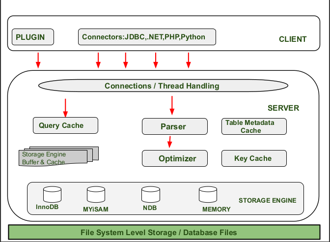
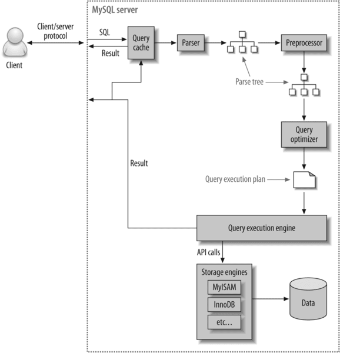

# MySql Architecture

In-depth Notes about MySql , MySql/InnoDB architecture, ACID, connection and thread handling  and other MySql related concepts.

## MySQL Architecture

#### Introduction

To get the most from MySQL, you need to understand its design so that you can work with it, not against it. MySQL is flexible in many ways. For example, you can configure it to run well on a wide range of hardware, and it supports a variety of data types. However, MySQL's most unusual and important feature is its storage-engine architecture, whose design separates query processing and other server tasks from data storage and retrieval.

**MYSQL** is a relational database with a layered kind of architecture. The layers of the architecture include a server resource end at the middle, the storage engine at the bottom, and the client-end or query execution end at the top. It’s a three-layered architecture database system.

- The topmost layer contains the services that aren't unique to MySQL. They're services most network-based client/server tools or servers need: connection handling, authentication, security, and so forth.

- The second layer is where things get interesting. Much of MySQL's brains are here, including the code for query parsing, analysis, optimization, caching, and all the built-in functions (e.g., dates, times, math, and encryption). Any functionality provided across storage engines lives at this level: stored procedures, triggers, and views, for example.

- The third layer contains the storage engines. They are responsible for storing and retrieving all data stored "in" MySQL. The server communicates with them through the _storage engine API_. The API contains a couple of dozen low-level functions that perform operations such as "begin a transaction" or "fetch the row that has this primary key." The storage engines don't parse SQL or communicate with each other; they simply respond to requests from the server.


<p align="center">

</p>

#### Client

The Client sends request instructions to the Server. The client submits a request using valid MYSQL commands and expressions via Command Prompt or GUI screen. The output is shown on the screen if the expressions and commands are true. The following are some of the most relevant client layer services:

- **Connection Handling**- When a client sends a request to the server, the server accepts it and connects the client. When a client connects to the server at that time, the connection is given its own thread. All client-side queries are run with the aid of this thread.
- **Authentication**- When a client connects to an MYSQL account, authentication takes place on the server-side. The username, originating host, and password are used for authentication.
- **Security**- When a client connects successfully to MySQL server after authentication, the server verifies that the client has the permissions to run those queries against the MySQL server.

Each client connection gets its own thread within the server process. The connection's queries execute within that single thread, which in turn resides on one core or CPU. The server caches threads, so they don't need to be created and destroyed for each new connection.

When clients (applications) connect to the MySQL server, the server needs to authenticate them. Authentication is based on username, originating host, and password. Certificates can also be used across an Secure Sockets Layer (SSL) connection. Once a client has connected, the server verifies whether the client has privileges for each query it issues.

#### Server

The “Brain of MYSQL Architecture” is another name for this layer of the MYSQL system. When a client sends a request to the server, the server responds with output as soon as the instruction is matched. The following are the different sub-components of the MYSQL server:

- **Thread Handling**- When a client sends a request to the server, the server accepts it and connects the client. When a client connects to the server at that time, the connection is given its own thread. The thread management of the Server Layer provides this thread. The Thread Handling module also takes care of client-side queries that are run by the thread.
- **Parser**- A parser is a type of software component that creates a data structure (parse tree) from the given input. Lexical analysis is performed prior to parsing, in which the data is broken down into a number of tokens. After the data is accessible in smaller components, the parser performs Syntax and Semantics analysis and then generates a parse tree as an output.
- **Optimizer**- Once the parsing is complete, the Optimizer Block employs a variety of optimization techniques. These may include rewriting the query, determining the order in which it will read tables, choosing which indexes to use, and so on.
- **Query Cache**- Query Cache saves the entire result set for the query statement that was entered. MYSQL Server consults the query cache before parsing. When a client writes a query, if the query in the cache matches the query written by the client, the server skips parsing, optimization, and even execution and simply displays the output from the cache.
- **Buffer and Cache**- The cache and buffer will save the user’s previous query or issue. When a user types a query, it first goes to the Query Cache, which checks to see if the same query or problem exists in the cache. If the same question is open, it will produce results without interfering with the Parser and Optimizer.
- **Table Metadata Cache**- The metadata cache is a section of memory that stores information about databases, indexes, and objects. The metadata cache grows in size as the number of available databases, indexes, or objects grows.
- **Key Cache**- An index entry that uniquely identifies an object in a cache is known as a key cache.


#### Storage

The MYSQL database contains a different kind of storage engines which exist as a result of varying needs of databases. The storage engines are used to hold every user-created table in the database system. The **storage-end** facilitates the storing and retrieving of MYSQL data. The storage engine has an API that aids in the execution of the queries from the client end of the architecture just by passing rows back and forth in it.

**Note** :  MySQL’s default transactional storage engine and mostly used one is **InnoDB**, we will dicuss it in more details in the next section.

<p align="center">

</p>

#### The MySQL Client/Server Protocol

The protocol is half duplex, that means at any given time the MySQL server can be either sending or receiving messages, but not both.  
The client sends a query to the server as a single packet of data. This is why the `max_allowed_packet` configuration variable is important if you have large queries. Once the client sends the query, it doesn’t have the ball anymore; it can only wait for results. (If the query is too large, the server will refuse to receive any more data and throw an error), On the other hand response from the server usually consists of many packets of data. When the server responds, the client has to receive the entire result set that is why LIMIT plays a important role. When a client fetches rows from the server, it thinks it’s pulling them. But the truth is, the MySQL server is pushing the rows as it generates them. The client is only receiving the pushed rows; there is no way for it to tell the server to stop sending rows.

#### The Query Optimization Process

MySQL turns a SQL query into an execution plan for the query execution engine. It has several substeps: parsing, preprocessing, and optimization. Errors (for example, syntax errors) can be raised at any point in the process.

###### The parser and the preprocessor

MySQL’s `parser` breaks the query into tokens and builds a “parse tree” from them. The parser uses MySQL’s SQL grammar to interpret and validate the query. For instance, it ensures that the tokens in the query are valid and in the proper order, and it checks for mistakes such as quoted strings that aren’t terminated. The `preprocessor` then checks the resulting parse tree for additional semantics that the parser can’t resolve. For example, it checks that tables and columns exist, and it resolves names and aliases to ensure that column references aren’t ambiguous. Next, the preprocessor checks privileges. This is normally very fast unless your server has large numbers of privileges.

###### The query optimizer

The parse tree is now valid and ready for the optimizer to turn it into a query execution plan. A query can often be executed many different ways and produce the same result. The optimizer’s job is to find the best option.

MySQL uses a cost-based optimizer, which means it tries to predict the cost of various execution plans and choose the least expensive. The unit of cost was originally a single random 4 KB data page read, but it has become more sophisticated and now includes factors such as the estimated cost of executing a WHERE clause comparison. You can see how expensive the optimizer estimated a query to be by running the query, then inspecting the `Last_query_cost` session variable:

```sql
> SHOW STATUS LIKE ‘Last_query_cost’;
+-----------------+--------+
| Variable_name   | Value  |
+-----------------+--------+
| Last_query_cost | 10.123 |
+-----------------+--------+
```

This result means that the optimizer estimated it would need to do about 10 random data page reads to execute the query. It is based on various factors such as number of pages per table or index the cardinality (number of distinct values) of the indexes, the length of the rows and keys, and the key distribution. **The optimizer does not include the effects of any type of caching in its estimates — it assumes every read will result in a disk I/O operation**.

**Note** : **The optimizer might not always choose the best plan, for many reasons** such us  wrong statistics,  cost metric is not really the cost of running the query ...

#### The execution plan

MySQL doesn’t generate byte-code to execute a query, as many other database products do. Instead, the query execution plan is actually a tree of instructions that the query execution engine follows to produce the query results.

**Note** :  The final plan contains enough information to reconstruct the original query.  If you execute `EXPLAIN EXTENDED(query)` on a query, followed by `SHOW WARNINGS`, you’ll see the reconstructed query (The server generates the output from the execution plan. It thus has the same semantics as the original query, but not necessarily the same text).

#### The Query Execution Engine

MySQL simply follows the instructions given in the query execution plan. To execute the query, the server just repeats the instructions until there are no more rows to examine. Query execution engine communicates with storage engine through API call’s. Functions performed by the query execution are:

 - It acts as a dispatcher for all commands in the execution plan.
- It iterates through all the commands in the plan until the batch is complete And it interacts with the storage engine to retrieve and update data from tables and indexes.

## InnoDB Storage Engine Architecture

InnoDB is MySQL’s default transactional storage engine, as well as the most important and widely used. It was created to handle a large number of short-lived transactions that are normally completed rather than rolled back. It’s also common for non-transactional storage because of its performance and automatic crash recovery. Unless you have a good reason to use a different engine, you can use InnoDB for your tables.

<p align="center">

</p>

#### InnoDB In-Memory Structures

###### Buffer Pool

The buffer pool is an area in main memory where `InnoDB` caches table and index data as it is accessed. The buffer pool permits frequently used data to be accessed directly from memory, which speeds up processing. On dedicated servers, up to 80% of physical memory is often assigned to the buffer pool.

For efficiency of high-volume read operations, the buffer pool is divided into pages that can potentially hold multiple rows. For efficiency of cache management, the buffer pool is implemented as a linked list of pages; data that is rarely used is aged out of the cache using a variation of the least recently used (LRU) algorithm.

By default, pages read by queries are immediately moved into the new sublist, meaning they stay in the buffer pool longer.

Knowing how to take advantage of the buffer pool to keep frequently accessed data in memory is an important aspect of MySQL tuning


###### Change Buffer

The change buffer is a special data structure that caches changes to secondary index pages when those pages are not in the buffer pool. The buffered changes, which may result from `INSERT`, `UPDATE`, or `DELETE` operations , are merged later when the pages are loaded into the buffer pool by other read operations.

In memory, the change buffer occupies part of the buffer pool. On disk, the change buffer is part of the system tablespace, where index changes are buffered when the database server is shut down.

###### Adaptive Hash Index

The adaptive hash index enables `InnoDB` to perform more like an in-memory database on systems with appropriate combinations of workload and sufficient memory for the buffer pool without sacrificing transactional features or reliability

Hash indexes are built on demand for the pages of the index that are accessed often. If `InnoDB` notices that queries could benefit from building a hash index, it does so automatically.

If a table fits almost entirely in main memory, a hash index speeds up queries by enabling _direct_ lookup of any element, turning the index value into a sort of pointer.

######  Log Buffer

The log buffer is the memory area that holds data to be written to the log files on disk. Log buffer size is defined by the `innodb_log_buffer_size`  variable. The default size is 16MB. The contents of the log buffer are periodically flushed to disk. A large log buffer enables large transactions to run without the need to write redo log data to disk before the transactions commit. Thus, if you have transactions that update, insert, or delete many rows, increasing the size of the log buffer saves disk I/O.

#### InnoDB On-Disk Structures

On disk-structures for InnoDB can be divided into the following : 

- Tables
- Indexes
- Tablespaces
- Doublewrite Buffer
- Redo Log
- Undo Logs

###### Tablespace

- **_The System Tablespace_**  `fileName.ibdata1` :  is the storage area for the change buffer. It may also contain table and index data if tables are created in the system tablespace rather than file-per-table or general tablespaces. In previous MySQL versions, the system tablespace contained the `InnoDB` data dictionary. In MySQL 8.0, `InnoDB` stores metadata in the MySQL data dictionary. In previous MySQL releases, the system tablespace also contained the doublewrite buffer storage area. This storage area resides in separate doublewrite files as of MySQL 8.0.20.
- **_File-Per-Table Tablespaces_**  `fileName.ibd` : A file-per-table tablespace contains data and indexes for a single `InnoDB` table, and is stored on the file system in a single data file. `InnoDB` creates tables in file-per-table tablespaces by default. This behavior is controlled by the `innodb_file_per_table`  variable. Disabling `innodb_file_per_table` causes `InnoDB` to create tables in the system tablespace.
-  **_General Tablespaces_** : A general tablespace is a shared `InnoDB` tablespace that is created using `CREATE TABLESPACE` syntax. Similar to the system tablespace, general tablespaces are shared tablespaces capable of storing data for multiple tables.
- **_Undo Tablespaces_** : Undo tablespaces contain undo logs, which are collections of records containing information about how to undo the latest change by a transaction to a clustered index record.
- **_Temporary Tablespaces_** : `InnoDB` uses session temporary tablespaces and a global temporary tablespace.
	- **_Session temporary tablespaces_** store user-created temporary tables and internal temporary tables created by the optimizer when `InnoDB` is configured as the storage engine for on-disk internal temporary tables. Beginning with MySQL 8.0.16, the storage engine used for on-disk internal temporary tables is `InnoDB`. (Previously, the storage engine was determined by the value of `internal_tmp_disk_storage_engine`.  When a session disconnects, its temporary tablespaces are truncated and released back to the pool. A pool of 10 temporary tablespaces is created when the server is started.  Session temporary tablespace files are five pages in size when created and have an `.ibt` file name extension.
	- **_Global Temporary Tablespace_** `ibtmp1` stores rollback segments for changes made to user-created temporary tables.

###### Doublewrite Buffer

The doublewrite buffer is a storage area where `InnoDB` writes pages flushed from the buffer pool before writing the pages to their proper positions in the `InnoDB` data files. If there is an operating system, storage subsystem, or unexpected **mysqld**  process exit in the middle of a page write, `InnoDB` can find a good copy of the page from the doublewrite buffer during crash recovery.

Although data is written twice, the doublewrite buffer does not require twice as much I/O overhead or twice as many I/O operations. Data is written to the doublewrite buffer in a large sequential chunk, with a single `fsync()` call to the operating system (except in the case that `innodb_flush_method` is set to `O_DIRECT_NO_FSYNC`).

Prior to MySQL 8.0.20, the doublewrite buffer storage area is located in the `InnoDB` system tablespace. As of MySQL 8.0.20, the doublewrite buffer storage area is located in doublewrite files.

###### Redo Log

The redo log is a disk-based data structure used during crash recovery to correct data written by incomplete transactions. During normal operations, the redo log encodes requests to change table data that result from SQL statements or low-level API calls. Modifications that did not finish updating data files before an unexpected shutdown are replayed automatically during initialization and before connections are accepted.

The redo log is physically represented on disk by redo log files. Data that is written to redo log files is encoded in terms of records affected, and this data is collectively referred to as redo. The passage of data through redo log files is represented by an ever-increasing LSN (Long Sequence Number) value. Redo log data is appended as data modifications occur, and the oldest data is truncated as the checkpoint progresses.


######  Undo Logs

An undo log is a collection of undo log records associated with a single read-write transaction. An undo log record contains information about how to undo the latest change by a transaction to a clustered index record. If another transaction needs to see the original data as part of a consistent read operation, the unmodified data is retrieved from undo log records. Undo logs exist within [undo log segments](https://dev.mysql.com/doc/refman/8.0/en/glossary.html#glos_undo_log_segment "undo log segment"), which are contained within [rollback segments](https://dev.mysql.com/doc/refman/8.0/en/glossary.html#glos_rollback_segment "rollback segment"). Rollback segments reside in [undo tablespaces](https://dev.mysql.com/doc/refman/8.0/en/glossary.html#glos_undo_tablespace "undo tablespace") and in the [global temporary tablespace](https://dev.mysql.com/doc/refman/8.0/en/glossary.html#glos_global_temporary_tablespace "global temporary tablespace").

Undo logs that reside in the global temporary tablespace are used for transactions that modify data in user-defined temporary tables. These undo logs are not redo-logged, as they are not required for crash recovery. They are used only for rollback while the server is running. This type of undo log benefits performance by avoiding redo logging I/O.

## MySQL Connection/Threads Handling

The MySQL Server (mysqld) executes as a single OS _process_, with multiple _threads_ executing concurrent activities. MySQL does not have its own thread implementation, but relies on the thread implementation of the underlying OS. When a user _connects_ to the database a _user thread_ is created inside mysqld and this user thread executes user queries,  sending results back to the user, until the user _disconnects_.

When more and more users connect to the database, more and more user threads execute in parallel. As long as all user threads execute as if they are alone we can say that the system (MySQL) scales well. But at some point we reach a limit and adding more user threads will not be useful or efficient.

#### Connection

_Connections_ correspond to _Sessions_ in SQL standard terminology. A client connects to the MySQL Server and stays connected until it does a disconnect.

<p align="center">

</p>

**_Clients_** A MySQL Client is a command line tool or an application that talks to the MySQL Server  over the MySQL Client-Server protocol.

**_Connection Requests_** The MySQL Clients send _connection requests_ to the MySQL Server. A connection request is simply a TCP-IP connect message sent to port 3306 on the server host machine.