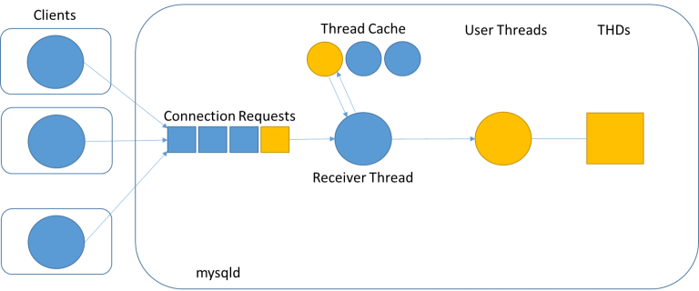

# MySql Architecture

In-depth Notes about MySql , MySql/InnoDB architecture, concurrency control ACID, connection and thread handling  and other MySql related concepts.

# Table Of Contents


## MySQL Architecture

#### Introduction

To get the most from MySQL, you need to understand its design so that you can work with it, not against it. MySQL is flexible in many ways. For example, you can configure it to run well on a wide range of hardware, and it supports a variety of data types. However, MySQL's most unusual and important feature is its storage-engine architecture, whose design separates query processing and other server tasks from data storage and retrieval.

**MYSQL** is a relational database with a layered kind of architecture. The layers of the architecture include a server resource end at the middle, the storage engine at the bottom, and the client-end or query execution end at the top. It’s a three-layered architecture database system.

- The topmost layer contains the services that aren't unique to MySQL. They're services most network-based client/server tools or servers need: connection handling, authentication, security, and so forth.

- The second layer is where things get interesting. Much of MySQL's brains are here, including the code for query parsing, analysis, optimization, caching, and all the built-in functions (e.g., dates, times, math, and encryption). Any functionality provided across storage engines lives at this level: stored procedures, triggers, and views, for example.

- The third layer contains the storage engines. They are responsible for storing and retrieving all data stored "in" MySQL. The server communicates with them through the _storage engine API_. The API contains a couple of dozen low-level functions that perform operations such as "begin a transaction" or "fetch the row that has this primary key." The storage engines don't parse SQL or communicate with each other; they simply respond to requests from the server.


<p align="center">

</p>

#### Client

The Client sends request instructions to the Server. The client submits a request using valid MYSQL commands and expressions via Command Prompt or GUI screen. The output is shown on the screen if the expressions and commands are true. The following are some of the most relevant client layer services:

- **Connection Handling**- When a client sends a request to the server, the server accepts it and connects the client. When a client connects to the server at that time, the connection is given its own thread. All client-side queries are run with the aid of this thread.
- **Authentication**- When a client connects to an MYSQL account, authentication takes place on the server-side. The username, originating host, and password are used for authentication.
- **Security**- When a client connects successfully to MySQL server after authentication, the server verifies that the client has the permissions to run those queries against the MySQL server.

Each client connection gets its own thread within the server process. The connection's queries execute within that single thread, which in turn resides on one core or CPU. The server caches threads, so they don't need to be created and destroyed for each new connection.

When clients (applications) connect to the MySQL server, the server needs to authenticate them. Authentication is based on username, originating host, and password. Certificates can also be used across an Secure Sockets Layer (SSL) connection. Once a client has connected, the server verifies whether the client has privileges for each query it issues.

#### Server

The “Brain of MYSQL Architecture” is another name for this layer of the MYSQL system. When a client sends a request to the server, the server responds with output as soon as the instruction is matched. The following are the different sub-components of the MYSQL server:

- **Thread Handling**- When a client sends a request to the server, the server accepts it and connects the client. When a client connects to the server at that time, the connection is given its own thread. The thread management of the Server Layer provides this thread. The Thread Handling module also takes care of client-side queries that are run by the thread.
- **Parser**- A parser is a type of software component that creates a data structure (parse tree) from the given input. Lexical analysis is performed prior to parsing, in which the data is broken down into a number of tokens. After the data is accessible in smaller components, the parser performs Syntax and Semantics analysis and then generates a parse tree as an output.
- **Optimizer**- Once the parsing is complete, the Optimizer Block employs a variety of optimization techniques. These may include rewriting the query, determining the order in which it will read tables, choosing which indexes to use, and so on.
- **Query Cache**- Query Cache saves the entire result set for the query statement that was entered. MYSQL Server consults the query cache before parsing. When a client writes a query, if the query in the cache matches the query written by the client, the server skips parsing, optimization, and even execution and simply displays the output from the cache.
- **Buffer and Cache**- The cache and buffer will save the user’s previous query or issue. When a user types a query, it first goes to the Query Cache, which checks to see if the same query or problem exists in the cache. If the same question is open, it will produce results without interfering with the Parser and Optimizer.
- **Table Metadata Cache**- The metadata cache is a section of memory that stores information about databases, indexes, and objects. The metadata cache grows in size as the number of available databases, indexes, or objects grows.
- **Key Cache**- An index entry that uniquely identifies an object in a cache is known as a key cache.


#### Storage

The MYSQL database contains a different kind of storage engines which exist as a result of varying needs of databases. The storage engines are used to hold every user-created table in the database system. The **storage-end** facilitates the storing and retrieving of MYSQL data. The storage engine has an API that aids in the execution of the queries from the client end of the architecture just by passing rows back and forth in it.

**Note** :  MySQL’s default transactional storage engine and mostly used one is **InnoDB**, we will dicuss it in more details in the next section.

<p align="center">

</p>

#### The MySQL Client/Server Protocol

The protocol is half duplex, that means at any given time the MySQL server can be either sending or receiving messages, but not both.  
The client sends a query to the server as a single packet of data. This is why the `max_allowed_packet` configuration variable is important if you have large queries. Once the client sends the query, it doesn’t have the ball anymore; it can only wait for results. (If the query is too large, the server will refuse to receive any more data and throw an error), On the other hand response from the server usually consists of many packets of data. When the server responds, the client has to receive the entire result set that is why LIMIT plays a important role. When a client fetches rows from the server, it thinks it’s pulling them. But the truth is, the MySQL server is pushing the rows as it generates them. The client is only receiving the pushed rows; there is no way for it to tell the server to stop sending rows.

#### The Query Optimization Process

MySQL turns a SQL query into an execution plan for the query execution engine. It has several substeps: parsing, preprocessing, and optimization. Errors (for example, syntax errors) can be raised at any point in the process.

###### The parser and the preprocessor

MySQL’s `parser` breaks the query into tokens and builds a “parse tree” from them. The parser uses MySQL’s SQL grammar to interpret and validate the query. For instance, it ensures that the tokens in the query are valid and in the proper order, and it checks for mistakes such as quoted strings that aren’t terminated. The `preprocessor` then checks the resulting parse tree for additional semantics that the parser can’t resolve. For example, it checks that tables and columns exist, and it resolves names and aliases to ensure that column references aren’t ambiguous. Next, the preprocessor checks privileges. This is normally very fast unless your server has large numbers of privileges.

###### The query optimizer

The parse tree is now valid and ready for the optimizer to turn it into a query execution plan. A query can often be executed many different ways and produce the same result. The optimizer’s job is to find the best option.

MySQL uses a cost-based optimizer, which means it tries to predict the cost of various execution plans and choose the least expensive. The unit of cost was originally a single random 4 KB data page read, but it has become more sophisticated and now includes factors such as the estimated cost of executing a WHERE clause comparison. You can see how expensive the optimizer estimated a query to be by running the query, then inspecting the `Last_query_cost` session variable:

```sql
> SHOW STATUS LIKE ‘Last_query_cost’;
+-----------------+--------+
| Variable_name   | Value  |
+-----------------+--------+
| Last_query_cost | 10.123 |
+-----------------+--------+
```

This result means that the optimizer estimated it would need to do about 10 random data page reads to execute the query. It is based on various factors such as number of pages per table or index the cardinality (number of distinct values) of the indexes, the length of the rows and keys, and the key distribution. **The optimizer does not include the effects of any type of caching in its estimates — it assumes every read will result in a disk I/O operation**.

**Note** : **The optimizer might not always choose the best plan, for many reasons** such us  wrong statistics,  cost metric is not really the cost of running the query ...

#### The execution plan

MySQL doesn’t generate byte-code to execute a query, as many other database products do. Instead, the query execution plan is actually a tree of instructions that the query execution engine follows to produce the query results.

**Note** :  The final plan contains enough information to reconstruct the original query.  If you execute `EXPLAIN EXTENDED(query)` on a query, followed by `SHOW WARNINGS`, you’ll see the reconstructed query (The server generates the output from the execution plan. It thus has the same semantics as the original query, but not necessarily the same text).

#### The Query Execution Engine

MySQL simply follows the instructions given in the query execution plan. To execute the query, the server just repeats the instructions until there are no more rows to examine. Query execution engine communicates with storage engine through API call’s. Functions performed by the query execution are:

 - It acts as a dispatcher for all commands in the execution plan.
- It iterates through all the commands in the plan until the batch is complete And it interacts with the storage engine to retrieve and update data from tables and indexes.

## InnoDB Storage Engine Architecture

InnoDB is MySQL’s default transactional storage engine, as well as the most important and widely used. It was created to handle a large number of short-lived transactions that are normally completed rather than rolled back. It’s also common for non-transactional storage because of its performance and automatic crash recovery. Unless you have a good reason to use a different engine, you can use InnoDB for your tables.

<p align="center">

</p>

#### InnoDB In-Memory Structures

###### Buffer Pool

The buffer pool is an area in main memory where `InnoDB` caches table and index data as it is accessed. The buffer pool permits frequently used data to be accessed directly from memory, which speeds up processing. On dedicated servers, up to 80% of physical memory is often assigned to the buffer pool.

For efficiency of high-volume read operations, the buffer pool is divided into pages that can potentially hold multiple rows. For efficiency of cache management, the buffer pool is implemented as a linked list of pages; data that is rarely used is aged out of the cache using a variation of the least recently used (LRU) algorithm.

By default, pages read by queries are immediately moved into the new sublist, meaning they stay in the buffer pool longer.

Knowing how to take advantage of the buffer pool to keep frequently accessed data in memory is an important aspect of MySQL tuning


###### Change Buffer

The change buffer is a special data structure that caches changes to secondary index pages when those pages are not in the buffer pool. The buffered changes, which may result from `INSERT`, `UPDATE`, or `DELETE` operations , are merged later when the pages are loaded into the buffer pool by other read operations.

In memory, the change buffer occupies part of the buffer pool. On disk, the change buffer is part of the system tablespace, where index changes are buffered when the database server is shut down.

###### Adaptive Hash Index

The adaptive hash index enables `InnoDB` to perform more like an in-memory database on systems with appropriate combinations of workload and sufficient memory for the buffer pool without sacrificing transactional features or reliability

Hash indexes are built on demand for the pages of the index that are accessed often. If `InnoDB` notices that queries could benefit from building a hash index, it does so automatically.

If a table fits almost entirely in main memory, a hash index speeds up queries by enabling _direct_ lookup of any element, turning the index value into a sort of pointer.

######  Log Buffer

The log buffer is the memory area that holds data to be written to the log files on disk. Log buffer size is defined by the `innodb_log_buffer_size`  variable. The default size is 16MB. The contents of the log buffer are periodically flushed to disk. A large log buffer enables large transactions to run without the need to write redo log data to disk before the transactions commit. Thus, if you have transactions that update, insert, or delete many rows, increasing the size of the log buffer saves disk I/O.

#### InnoDB On-Disk Structures

On disk-structures for InnoDB can be divided into the following : 

- Tables
- Indexes
- Tablespaces
- Doublewrite Buffer
- Redo Log
- Undo Logs

###### Tablespace

- **_The System Tablespace_**  `fileName.ibdata1` :  is the storage area for the change buffer. It may also contain table and index data if tables are created in the system tablespace rather than file-per-table or general tablespaces. In previous MySQL versions, the system tablespace contained the `InnoDB` data dictionary. In MySQL 8.0, `InnoDB` stores metadata in the MySQL data dictionary. In previous MySQL releases, the system tablespace also contained the doublewrite buffer storage area. This storage area resides in separate doublewrite files as of MySQL 8.0.20.
- **_File-Per-Table Tablespaces_**  `fileName.ibd` : A file-per-table tablespace contains data and indexes for a single `InnoDB` table, and is stored on the file system in a single data file. `InnoDB` creates tables in file-per-table tablespaces by default. This behavior is controlled by the `innodb_file_per_table`  variable. Disabling `innodb_file_per_table` causes `InnoDB` to create tables in the system tablespace.
-  **_General Tablespaces_** : A general tablespace is a shared `InnoDB` tablespace that is created using `CREATE TABLESPACE` syntax. Similar to the system tablespace, general tablespaces are shared tablespaces capable of storing data for multiple tables.
- **_Undo Tablespaces_** : Undo tablespaces contain undo logs, which are collections of records containing information about how to undo the latest change by a transaction to a clustered index record.
- **_Temporary Tablespaces_** : `InnoDB` uses session temporary tablespaces and a global temporary tablespace.
	- **_Session temporary tablespaces_** store user-created temporary tables and internal temporary tables created by the optimizer when `InnoDB` is configured as the storage engine for on-disk internal temporary tables. Beginning with MySQL 8.0.16, the storage engine used for on-disk internal temporary tables is `InnoDB`. (Previously, the storage engine was determined by the value of `internal_tmp_disk_storage_engine`.  When a session disconnects, its temporary tablespaces are truncated and released back to the pool. A pool of 10 temporary tablespaces is created when the server is started.  Session temporary tablespace files are five pages in size when created and have an `.ibt` file name extension.
	- **_Global Temporary Tablespace_** `ibtmp1` stores rollback segments for changes made to user-created temporary tables.

###### Doublewrite Buffer

The doublewrite buffer is a storage area where `InnoDB` writes pages flushed from the buffer pool before writing the pages to their proper positions in the `InnoDB` data files. If there is an operating system, storage subsystem, or unexpected **mysqld**  process exit in the middle of a page write, `InnoDB` can find a good copy of the page from the doublewrite buffer during crash recovery.

Although data is written twice, the doublewrite buffer does not require twice as much I/O overhead or twice as many I/O operations. Data is written to the doublewrite buffer in a large sequential chunk, with a single `fsync()` call to the operating system (except in the case that `innodb_flush_method` is set to `O_DIRECT_NO_FSYNC`).

Prior to MySQL 8.0.20, the doublewrite buffer storage area is located in the `InnoDB` system tablespace. As of MySQL 8.0.20, the doublewrite buffer storage area is located in doublewrite files.

###### Redo Log

The redo log is a disk-based data structure used during crash recovery to correct data written by incomplete transactions. During normal operations, the redo log encodes requests to change table data that result from SQL statements or low-level API calls. Modifications that did not finish updating data files before an unexpected shutdown are replayed automatically during initialization and before connections are accepted.

The redo log is physically represented on disk by redo log files. Data that is written to redo log files is encoded in terms of records affected, and this data is collectively referred to as redo. The passage of data through redo log files is represented by an ever-increasing LSN (Long Sequence Number) value. Redo log data is appended as data modifications occur, and the oldest data is truncated as the checkpoint progresses.


######  Undo Logs

An undo log is a collection of undo log records associated with a single read-write transaction. An undo log record contains information about how to undo the latest change by a transaction to a clustered index record. If another transaction needs to see the original data as part of a consistent read operation, the unmodified data is retrieved from undo log records. Undo logs exist within [undo log segments](https://dev.mysql.com/doc/refman/8.0/en/glossary.html#glos_undo_log_segment "undo log segment"), which are contained within [rollback segments](https://dev.mysql.com/doc/refman/8.0/en/glossary.html#glos_rollback_segment "rollback segment"). Rollback segments reside in [undo tablespaces](https://dev.mysql.com/doc/refman/8.0/en/glossary.html#glos_undo_tablespace "undo tablespace") and in the [global temporary tablespace](https://dev.mysql.com/doc/refman/8.0/en/glossary.html#glos_global_temporary_tablespace "global temporary tablespace").

Undo logs that reside in the global temporary tablespace are used for transactions that modify data in user-defined temporary tables. These undo logs are not redo-logged, as they are not required for crash recovery. They are used only for rollback while the server is running. This type of undo log benefits performance by avoiding redo logging I/O.

## MySQL Connection/Threads Handling

The MySQL Server (mysqld) executes as a single OS _process_, with multiple _threads_ executing concurrent activities. MySQL does not have its own thread implementation, but relies on the thread implementation of the underlying OS. When a user _connects_ to the database a _user thread_ is created inside mysqld and this user thread executes user queries,  sending results back to the user, until the user _disconnects_.

When more and more users connect to the database, more and more user threads execute in parallel. As long as all user threads execute as if they are alone we can say that the system (MySQL) scales well. But at some point we reach a limit and adding more user threads will not be useful or efficient.

#### Connection

_Connections_ correspond to _Sessions_ in SQL standard terminology. A client connects to the MySQL Server and stays connected until it does a disconnect.

<p align="center">

</p>

**_Clients_** : A MySQL Client is a command line tool or an application that talks to the MySQL Server  over the MySQL Client-Server protocol.

**_Connection Requests_** : The MySQL Clients send _connection requests_ to the MySQL Server. A connection request is simply a TCP-IP connect message sent to port 3306 on the server host machine.

**_Receiver Thread_** Incoming connection requests are queued and then processed by the _receiver thread_ one by one. The only job of the receiver thread is to create a _user thread_, further processing is done by the user thread.

**_Thread Cache_** : The receiver thread will either create a new OS thread or reuse an existing “free” OS thread if found in the thread cache. The thread cache used to be important for connect speed when OS threads were costly to create. Nowadays creating an OS thread is relatively cheap and the thread cache can perhaps be said to be legacy. The `thread_cache_size` default value is calculated as `8 + (max_connections / 100)` and is rarely changed. It might make sense to try increasing the thread cache in cases where number of connections fluctuates between having very few connections and having many connections.

**_User Thread._** :  It is the user thread that handles the client-server protoco(e.g. sends back the initial handshake packet). This _user thread_ will allocate and initialize the corresponding `THD`, and then continue with capability negotiation and authentication. In this process the user credentials are stored in the THD’s _security context_. If everything goes well in the **connection phase**, the user thread will enter the **command phase**.

**_THD_** :  The connection is represented by a data structure called the THD which is created when the connection is established and deleted when the connection is dropped. There is always a `one-to-one` correspondence between a user connection and a THD, i.e. THDs are not reused across connections. The size of the THD is ~10K. The THD is a large data structure which is used to keep track of various aspects of execution state. Memory rooted in the THD will grow significantly during query execution, but exactly how much it grows will depend upon the query.  For memory planning purposes we recommend to plan for ~10MB per connection on average.

#### Disconnection

When a MySQL Client disconnects from a MySQL Server. The Client sends a  `COM_QUIT` command which causes the server to close the socket. A disconnect can also happen when either side closes its end of the socket. Upon a disconnect the user thread will clean up, deallocate the THD, and finally put itself in the Thread Cache as “suspended” if there are free slots. If there are no free slots, the user thread will be “terminated”.


<p align="center">

</p>

####  InnoDB's Thread Concurrency

A thread will happily execute instructions until it needs to wait for something or until it has used its timeshare as decided by the OS scheduler. There are three things a thread might need to wait for:  A _mutex_, a _database lock_, or _IO_ (will read more about that in the _concurrency control_ section).

What happens when a thread is suspended by the OS? First, it is not progressing anymore. Second, it might hold mutexes or locks which prevent other threads from progressing. Third, when it is woken up again, cached items might have been evicted requiring data to be re-read. At some point more threads will just cause queues of waiting threads to grow and the system will be soon be jammed. The solution is to limit the number of user threads by limiting `max_connections`

###### the thread concurrency process

In situations where it is helpful to minimize context switching between threads, `InnoDB` can use a number of techniques to limit the number of concurrently executing operating system threads (and thus the number of requests that are processed at any one time). When `InnoDB` receives a new request from a user session, if the number of threads concurrently executing is at a pre-defined limit, the new request sleeps for a short time before it tries again. A request that cannot be rescheduled after the sleep is put in a first-in/first-out queue and eventually is processed. Threads waiting for locks are not counted in the number of concurrently executing threads.

The InnoDB process is running and accept threads to execute them .While they  are threads that are in queue to enter the InnoDB process,

<p align="center">

</p>

- **Innodb_thread_concurrency** is the maximum number of threads permitted within InnoDB at the same time. If the maximum is reached, threads wait in a queue until a slot is available. In image above, the maximum number of threads allowed to be in InnoDB at one time is 5. The rest of the threads have to wait for a slot to become available.

>The default for innodb_thread_concurrency is 0, which means no limit. With the default setting, InnoDB will take and process threads as they come (no waiting in a queue). If the CPU or IO subsystem reaches a point of saturation, performance will start to suffer.

>Giving innodb_thread_concurrency a value greater than 0 turns on InnoDB’s concurrency control mechanism (`MVCC`). It is InnoDB’s internal mechanism that manages and controls threads being executed simultaneously.


 - **Innodb_thread_sleep_delay**: if the number of executing threads matches the value of innodb_thread_concurrency (assuming it’s value is not 0), a new operation/query requesting a thread will be denied access to the InnoDB kernel, and it will then wait a for a number of microseconds equal to the value of this variable before trying one more time to complete its storage engine request. If it’s still unable to do so after that single retry then it’s placed into the queue of operations waiting for a thread, initiating a context switch. By doing one check before going into the queue it reduces the chance of system level context switching.. If there is no slot available, the threads in the queue follow a FIFO waiting system demonstrated in Figure above. 

- **innodb_adaptive_max_sleep_delay** : When this value is set to a value other than 0, it enables the adaptive adjustment of innodb_thread_sleep_delay up to the maximum value of this variable.

- **Innodb_concurrency_tickets** is the maximum number of tickets given when a thread enters InnoDB for processing. One ticket will allow a query to perform one row operation. If the query runs out of tickets, it is expelled out of InnoDB and goes back into the waiting queue. In Figure above, innodb_thread_tickets is set to default (5000 tickets). Three threads will be expelled from InnoDB, the ones with 5001, 10000, and 20000 tickets. However, they will each process 5000 tickets before they leave a spot available for the next thread in the queue. Since one of the threads only has 100 tickets, that thread along with the next 2 threads in the queue will be completed before them.

>Now, will the thread with 100 tickets and the next 2 in the queue be completed before the thread with 500 tickets? Maybe! If you add all the tickets together, it is 300 tickets compared to 500 tickets but 2 threads have to wait for the sleep delay. It will be a pretty close call.

You can limit the number of concurrent threads by setting the configuration parameter `innodb_thread_concurrency`  Once the number of executing threads reaches this limit, additional threads sleep for a number of microseconds, set by the configuration parameter `innodb_thread_sleep_delay` before being placed into the queue.

## MySql Concurrency Control

Anytime more than one query needs to change data at the same time, the problem of concurrency control arises

Concurrent accessing of data is comparatively easy when all users are only reading data, as there is no means that they can interfere with one another. However, when multiple users are accessing the database at the same time, and at least one is updating data, there may be the case of interference, which can result in data inconsistencies.

They are many Concurrency Control techniques MySql employs such : Read-Writes locks , Isolation Level (`REPEATABLE READ`), MVCC 

#### Read/Write Locks

Systems that deal with concurrent read/write access typically implement a locking system that consists of two lock types. These locks are usually known as _shared locks_ and _exclusive locks_, or _read locks_ and _write locks_.

**Read locks**  on a resource are shared, or mutually nonblocking: many clients may read from a resource at the same time and not interfere with each other (blocking writes) 
**Write locks** on the other hand, are exclusive—i.e., they block both read locks and other write locks

###### Lock Granularity and Management

Locks consume resources, one way to improve the concurrency of a shared resource is to be more selective about what you lock. Rather than locking the entire resource, lock only the part that contains the data you need to change. Better yet, lock only the exact piece of data you plan to change. Minimizing the amount of data that you lock at any one time lets changes to a given resource occur simultaneously, as long as they don't conflict with each other.

- **Table locks** : Table-level locking systems always lock entire tables. For instance, the server uses a table-level lock for statements such as `ALTER TABLE`. 

```sql
#lock tables
LOCK TABLES table_name [AS alias_name] READ/WRITE;
# example
LOCK TABLES malidkha READ;

# unlock tables
UNLOCK TABLES;
```

-  **Row locks** :  Row-level locks serve a primary function to prevent multiple transactions from modifying the same row. Whenever a transaction needs to modify a row, a row lock is acquired
	- **Single-row locks** :  A statement can lock only _a single row_ at a time.
	- **Range locks** :A statement can lock _a range of rows_

```sql
#lock rows
# read lock
SELECT ... FOR SHARE
SELECT ... LOCK IN SHARE MODE
# write lock
SELECT ... FOR UPDATE

## lock is realeased after the transaction is commited(or row is written to)

# example
SELECT id from t1 where pk = 10 FOR SHARE
SELECT id from t1 where pk = 10 LOCK IN SHARE MODE
SELECT id from t1 where pk = 10 FOR UPDATE
```

**Note** : Row-level locking systems can lock entire tables if the WHERE clause of a statement cannot use an index

**Note 2** : If `autocommit` is set to 1 (the default), the LOCK IN SHARE MODE and FOR UPDATE clauses have no effect in InnoDB.

#### Transactions

A transaction is a group of SQL queries that are treated _atomically_, as a single unit of work. If the database engine can apply the entire group of queries to a database, it does so, but if any of them can't be done because of a crash or other reason, none of them is applied. It's all or nothing.

You start a transaction with the `START TRANSACTION` statement and then either make its changes permanent with `COMMIT` or discard the changes with `ROLLBACK`.

MySQL operates in `AUTOCOMMIT` mode by default. This means that unless you've explicitly begun a transaction, it automatically executes each query in a separate transaction.

###### ACID

_Atomicity_
> 	A transaction must function as a single indivisible unit of work so that the entire transaction is either applied or rolled back. When transactions are atomic, there is no such thing as a partially completed transaction: it's all or nothing.


_Consistency_
>	The database should always move from one consistent state to the next. Consistency guarantees that changes made within a transaction are consistent with database constraints and maintaining the data integrity. This includes all rules, constraints, and triggers. If the data gets into an illegal state, the whole transaction fails.


 _Isolation_
>	Isolation ensures that all transactions run in an isolated environment. That enables running transactions concurrently because transactions don’t interfere with each other.


_Durability_
>	Durability guarantees that once the transaction completes and changes are written to the database, they are persisted. This ensures that data within the system will persist even in the case of system failures like crashes or power outages.


###### Isolation Levels

The SQL standard defines four isolation levels, with specific rules for which changes are and aren't visible inside and outside a transaction. Lower isolation levels typically allow higher concurrency and have lower overhead.

**_READ UNCOMMITTED_**

>	In the `READ UNCOMMITTED` isolation level, transactions can view the results of uncommitted transactions. At this level, many problems can occur unless you really, really know what you are doing and have a good reason for doing it. This level is rarely used in practice, because its performance isn't much better than the other levels, which have many advantages. Reading uncommitted data is also known as a _dirty read_.


**_READ COMMITTED_**

>	The default isolation level for most database systems (but not MySQL!) is `READ COMMITTED`. It satisfies the simple definition of isolation used earlier: a transaction will see only those changes made by transactions that were already committed when it began, and its changes won't be visible to others until it has committed. This level still allows what's known as a _nonrepeatable read_. This means you can run the same statement twice and see different data.


**_REPEATABLE READ_**

> 	`REPEATABLE READ` solves the problems that `READ UNCOMMITTED` allows. It guarantees that any rows a transaction reads will "look the same" in subsequent reads within the same transaction, but in theory it still allows another tricky problem: `phantom reads`. Simply put, a phantom read can happen when you select some range of rows, another transaction inserts a new row into the range, and then you select the same range again; you will then see the new "phantom" row. InnoDB and Falcon solve the phantom read problem with `multiversion concurrency control`, which we explain later.

**Note** : `REPEATABLE READ` is MySQL's default transaction isolation level.

**_SERIALIZABLE_**

>	The highest level of isolation, `SERIALIZABLE`, solves the phantom read problem by forcing transactions to be ordered so that they can't possibly conflict. In a nutshell, `SERIALIZABLE` places a lock on every row it reads. At this level, a lot of timeouts and lock contention may occur. We've rarely seen people use this isolation level, but your application's needs may force you to accept the decreased concurrency in favor of the data stability that results.


###### Deadlocks

A _deadlock_ is when two or more transactions are mutually holding and requesting locks on the same resources, creating a cycle of dependencies. Deadlocks occur when transactions try to lock resources in a different order. They can happen whenever multiple transactions lock the same resources.

For example :


```sql
#Transaction #1
START TRANSACTION;
UPDATE StockPrice SET close = 45.50 WHERE stock_id = 4 and date = '2002-05-01';
UPDATE StockPrice SET close = 19.80 WHERE stock_id = 3 and date = '2002-05-02';
COMMIT;

#Transaction 2

START TRANSACTION;
UPDATE StockPrice SET high  = 20.12 WHERE stock_id = 3 and date = '2002-05-02';
UPDATE StockPrice SET high  = 47.20 WHERE stock_id = 4 and date = '2002-05-01';
COMMIT;
```

If you're unlucky, each transaction will execute its first query and update a row of data, locking it in the process. Each transaction will then attempt to update its second row, only to find that it is already locked. The two transactions will wait forever for each other to complete, unless something intervenes to break the deadlock.

> To combat this problem, database systems implement various forms of deadlock detection and timeouts. The more sophisticated systems, such as the InnoDB storage engine, will notice circular dependencies and return an error instantly. This is actually a very good thing—otherwise, deadlocks would manifest themselves as very slow queries. Others will give up after the query exceeds a `lock wait timeout`, which is not so good. The way InnoDB currently handles deadlocks is to roll back the transaction that has the fewest exclusive row locks (an approximate metric for which will be the easiest to roll back).


#### Multiversion Concurrency Control (MVCC)

Most of MySQL's transactional storage engines, such as InnoDB, Falcon, and PBXT, don't use a simple row-locking mechanism. Instead, they use row-level locking in conjunction with a technique for increasing concurrency known as _multiversion concurrency control_ (MVCC). MVCC is not unique to MySQL: Oracle, PostgreSQL, and some other database systems use it too.

You can think of MVCC as a twist on row-level locking; it avoids the need for locking at all in many cases and can have much lower overhead. Depending on how it is implemented, it can allow nonlocking reads, while locking only the necessary rows during write operations.

> MVCC works by keeping a snapshot of the data as it existed at some point in time. This means transactions can see a consistent view of the data, no matter how long they run. It also means different transactions can see different data in the same tables at the same time!

> InnoDB implements MVCC by storing with each row two additional, hidden values that record when the row was created and when it was expired (or deleted). Rather than storing the actual times at which these events occurred, the row stores the system version number at the time each event occurred. This is a number that increments each time a transaction begins. Each transaction keeps its own record of the current system version, as of the time it began. Each query has to check each row's version numbers against the transaction's version

Let's see how this applies to particular operations when the transaction isolation level is set to `REPEATABLE READ`:

`SELECT`

> 	InnoDB must examine each row to ensure that it meets two criteria:
> 	- InnoDB must find a version of the row that is at least as old as the transaction (i.e., its version must be less than or equal to the transaction's version). This ensures that either the row existed before the transaction began, or the transaction created or altered the row.
> 	- The row's deletion version must be undefined or greater than the transaction's version. This ensures that the row wasn't deleted before the transaction began.
> 	-  Rows that pass both tests may be returned as the query's result.

`INSERT`

>	InnoDB records the current system version number with the new row.

`DELETE`

> 	InnoDB records the current system version number as the row's deletion ID.

`UPDATE`

>	InnoDB writes a new copy of the row, using the system version number for the new row's version. It also writes the system version number as the old row's deletion version.

The result of all this extra record keeping is that most read queries never acquire locks. They simply read data as fast as they can, making sure to select only rows that meet the criteria. The drawbacks are that the storage engine has to store more data with each row, do more work when examining rows.

**Note** : MVCC works only with the `REPEATABLE READ` and `READ COMMITTED` isolation levels. `READ UNCOMMITTED` isn't MVCC-compatible because queries don't read the row version that's appropriate for their transaction version; they read the newest version, no matter what. `SERIALIZABLE` isn't MVCC-compatible because reads lock every row they return.


## Other Concepts and explanations

#### `SELECT LOCK IN SHARE MODE` and `SELECT FOR UPDATE` Behavior In InnoDB

```mysql
#SESSION1:

mysql> begin;

Query OK, 0 rows affected (0.00 sec)

mysql> insert into tst values(1);

Query OK, 1 row affected (0.00 sec)

#SESSION2:

mysql> begin ;

Query OK, 0 rows affected (0.00 sec)

mysql> select * from tst;

Empty set (0.01 sec)

#Session2 does not see any rows as transaction was not commited yet.

#SESSION1:

mysql> commit;

Query OK, 0 rows affected (0.01 sec)

#SESSION2:

mysql> select * from tst;

Empty set (0.00 sec)

mysql> select * from tst lock in share mode;

+---+

| i |

+---+

| 1 |

+---+

1 row in set (0.00 sec)

mysql> select * from tst for update;

+---+

| i |

+---+

| 1 |

+---+

1 row in set (0.00 sec)

#Standard SELECT does not see rows while SELECT for UPDATE and LOCK IN SHARE MODE  sees it.

```

What is happening? `SELECT for UPDATE` and `LOCK IN SHARE MODE` modifiers effectively run in `READ-COMMITTED` isolation mode even if current isolation mode is `REPEATABLE-READ`. 
**This is done because Innodb can only lock the current version of the row**. 
Think about a similar case and row being deleted. Even if Innodb would be able to set locks on rows which no more exist – would it do any good for you? Not really – for example, you could try to update the row which you just locked with `SELECT FOR UPDATE` but this row is already gone so you would get quite unexpected error updating the row which you thought you locked successfully. Anyway, it is done this way for good all other decisions would be even more troublesome. **This complexity is what you have to pay for multi-versioning**.


> `LOCK IN SHARE MODE` is actually often used to **bypass multi-versioning** and make sure we’re reading most current data, plus to ensure it can’t be changed. This, for example, can be used to read set of the rows, compute new values for some of them and write them back. If we would not use `LOCK IN SHARE MODE` we could be in trouble as rows could be updated before we write new values to them and such update could be lost. Note I said _some_ of them. If you want to read set of rows and modify all of them you may choose to use `SELECT FOR UPDATE`. This will ensure you get write locks for all rows at once which reduces the chance of `deadlocks` – lock will not need to be upgraded when an update happens. SELECT FOR UPDATE also blocks access to the data using LOCK IN SHARE MODE. So by using these two modifiers, you may effectively implement instant data invalidation – using SELECT FOR UPDATE to quickly lock data which is no more correct so it is not used while you recompute it. Note it also works if LOCK IN SHARE MODE is used with selects – standard selects are run in a non-locking mode which means they never lock any rows and just use old row versions if they were updated.

**Unlocking non matched rows** Imagine you’re running `DELETE FROM USERS WHERE NAME LIKE “%Heikki%”;` How many rows do you think will be locked? Actually, all of them, not only ones which are matched by like because locks are taken on Innodb level before MySQL performs like matching, and row is not unlocked if it does not match.

**Smarter deadlock victim scheduling** At this point transaction which made least updates is killed to resolve deadlock. Which means if a transaction takes a lot of locks but does not do many updates it may never have the chance to complete.

#### Double-Write buffer , Buffer Log , Write Ahead Log (Redo log) and Flushing

>`InnoDB` performs certain tasks in the background, including **flushing of dirty pages** from the **buffer pool**. Dirty pages are those that have been modified but are not yet written to the data files on disk.
 Buffer pool flushing is initiated when the percentage of dirty pages reaches the low water mark value defined by the `innodb_max_dirty_pages_pct_lwm`variable The default low water mark is 10% of buffer pool pages.
 The dirty pages are flushed to the **double-write buffer** and the **tablespace** storage
 The purpose of the **double-write buffer** is to prevent data corruption from partial page writes, while modified pages are copied from the innodb buffer pool to the tablespace. That is, if MySQL Server were to crash while InnoDB is writing a given page to disk, it could overwrite a page on disk partially. Even with the redo log, there would be no way to recover this page.

> The **log buffer** is an allocation in RAM. All writes to the redo log are saved in the log buffer first, because it's very fast to save some data in RAM. A transaction could be made of many changes affecting many individual rows, and writing to disk for every one of these rows would be too slow. So changes on their way to the redo log are saved in the log buffer first. Periodically, a group of changes in the log buffer are saved to disk, in the redo log. This happens when:
- You commit a transaction
- The log buffer is full (the log buffer has a fixed size)
- Every 1 second regardless of whether the log buffer is full

>The **redo log** called also **Write Ahead Log** is a disk-based data structure used during crash recovery to correct data written by **incomplete transactions**. During normal operations, the redo log encodes requests to change table data that result from SQL statements or low-level API calls. Modifications that did not finish updating data files before an unexpected shutdown are replayed automatically during initialization and before connections are accepted.


**Note** : the write-double log prevents data corruption(and to recover) from partial dirty pages writes, while redo log is to prevent data corruption(and to recover) from incomplete transactions.


<p align="center">

</p>

 Changes to pages are applied within so-called `mini transactions (mtr)`, which allow to modify multiple pages in atomic way. When a mini transaction commits, it writes its own  log records to the **log buffer**, increasing the global  modification number called LSN (Log Sequence Number). The mtr has the list of dirty pages that need to be added to the buffer pool specific flush list. Each flush list is ordered on the LSN. you can read more about such topic [here](https://dev.mysql.com/blog-archive/mysql-8-0-new-lock-free-scalable-wal-design/)

## Data Flushing Mechanisms in InnoDB

Durability is the **_D_** in the _ACI**D**_ properties of transactions in the context of _RDBMS_. Durability is the guarantee that data has been physically recorded to permanent storage (such as a hard disk), preventing any loss of data in the case of a sudden power outage or a hardware failure. In this sense, _RDBMS _ are heavy _IO_-bound applications, so it’s necessary to apply some techniques to improve performance while making the data durable.

#### **IO Access Mechanisms in Linux**

###### **_Read/Write_ system calls**

> When an application (_MySQL_, or other specific application running in the _user space_) executes a _read_ system call, _page cache_ (_write-back cache_ implemented in the  _OS_ kernel inside the system space) is looked at first. If the data is in _page cache_, then it’s copied out into the buffers (memory area) in the application address space. Otherwise, it’s loaded from persistent storage (_disk_) into _page cache_ for further accesses, as well as copied out into the application space.

> When an application executes a _write_ system call, the data moves from the buffers in the application address space into _page cache._ and the underlying _page_ (every piece of data lives inside a logical box called a _page_) gets marked as a _dirty page_. In order to synchronize _dirty pages_ with the storage, a background process called _write-back_ flushes them to the storage and evicts them from the _page cache_ some time afterward.

###### **_Mmap_ system call**

> Using this mechanism, the data file is mapped into the process address space (_MySQL_ process) using the _mmap_ system call. _Read_/_write_ operations are performed by directly accessing the address space. In this way, an extra step is eliminated while accessing the data. So, there is no need for intermediate buffers in the user space because every buffer cache is in the system space implemented as  _page cache_ by the kernel.

> If the data is in _page cache_, the kernel is bypassed and read operations are performed at memory speed. If the data is not in  _page cache_, a page-fault is issued and the kernel looks for the data for that page and loads the data in _page cache_ to be accessible to the application.
 
 > It’s very common for database engines to use this mechanism to access data files.
 
###### **Asynchronous IO**

> Asynchronous _IO (AIO)_ is a mechanism that prevents the calling thread from blocking. The application schedules the asynchronous operations using the _io_submit_ system call, but it’s not blocked. So, the _IO_ operation and the application logic can run in parallel. A separate _io_getevents_ system call is used to wait for and get the data as part of a completed _IO_ operation.


###### **_Sync/fsync/fdatasync/msync_ system calls**

> By default, the _write_ system call returns after all data has been copied from the user space into _page cache_ in the system space. There is no guarantee that data has actually reached storage.

> To support this scenario, the _sync_ system call is used to be sure the data is actually transferred from _page cache_ into storage.

> The `sync` system call allows a process to flush all buffers to disk while the `fsync` system call allows a process to flush the buffers specific to an open file.

> Both system calls return to the calling process only when the data has reached permanent storage and in the case of a hardware error, then it’s reported. RDBMS use `sync/fsync` in order to commit changes in storage to make it durable.

> The `fdatasync` system call is similar to `fsync`, except that the file metadata may not be updated unless the metadata is needed to access the data. For example, the last modified time won’t be updated, but it will make sure that all the blocks of the file can be found.

> The `msync` system call is used to flush modified data into storage when a file is mapped into memory using the _mmap_ system call. Without use of this call there is no guarantee that changes are written back before _munmap_ is called.


###### **_O_DIRECT_ flag**

> `O_DIRECT` is a flag passed when a file is opened. It instructs to bypass _page cache_ and perform any _IO_ operations directly against storage.

> So, the buffers in the application space are flushed directly to disk, without copying the data into _page cache_ first and waiting for the kernel to schedule _write-back_ operations. Also, the disk controller copies the data directly into _user space_, bypassing the kernel as well.

> Usually database systems (such as _MySQL_) use this mechanism to avoid the kernel caching mechanism and to implement their own specific caching layer and custom _IO_ scheduling in order to have fine-grained control of the access pattern.


###### **_O_SYNC_ flag**

> _O_SYNC_ is a flag passed when a file is opened. In this scenario, the _write_ system call transfers data to _page cache_, but it’s blocked until the data is actually transferred from _page cache_ to physical storage. There is no need to call the _sync_ system call after the _write_ system call.


###### **_O_SYNC + O_DIRECT_ flags**

> When a file is opened with both _O_SYNC + O_DIRECT_ flags, any _write_ operation is guaranteed to be durable


#### **_InnoDB_ flushing mechanism**

The parameter `innodb_flush_method` allows tuning the _IO scheduling._ We have the following options:

- Empty: This is the default value, and is equivalent to using the `FSYNC` option (see below).
-  `FSYNC`: Data and log files are opened with no options, and the `fsync`system call is used when the engine requires flushing the data and log files. This option causes double buffering:
    - _page cache_
    - _InnoDB_ buffer pools.
- `O_DSYNC` and  `O_SYNC`:  This flag is used to open the log files while the data files are opened with no options. The _fsync_ system call is executed to flush data files only. O_SYNC doesn’t disable double buffering caching at system level and all writes are synchronous.
 - `O_DIRECT`: Data files are opened with the _O_DIRECT_ flag. Log files are opened with no options. It usesthe  _fsync_ system call to flush the log files to storage, ensuring no double buffering on the data files, because all read and write operations go directly to disk.


##### [References]
- [High Performance MySQL: Optimization, Backups, and Replication Book](https://www.amazon.com/High-Performance-MySQL-Optimization-Replication/dp/1449314287)
- [https://dev.mysql.com/](https://dev.mysql.com/)
- [Data Flushing Mechanisms in InnoDB ](https://blog.toadworld.com/2017/10/19/data-flushing-mechanisms-in-innodb)